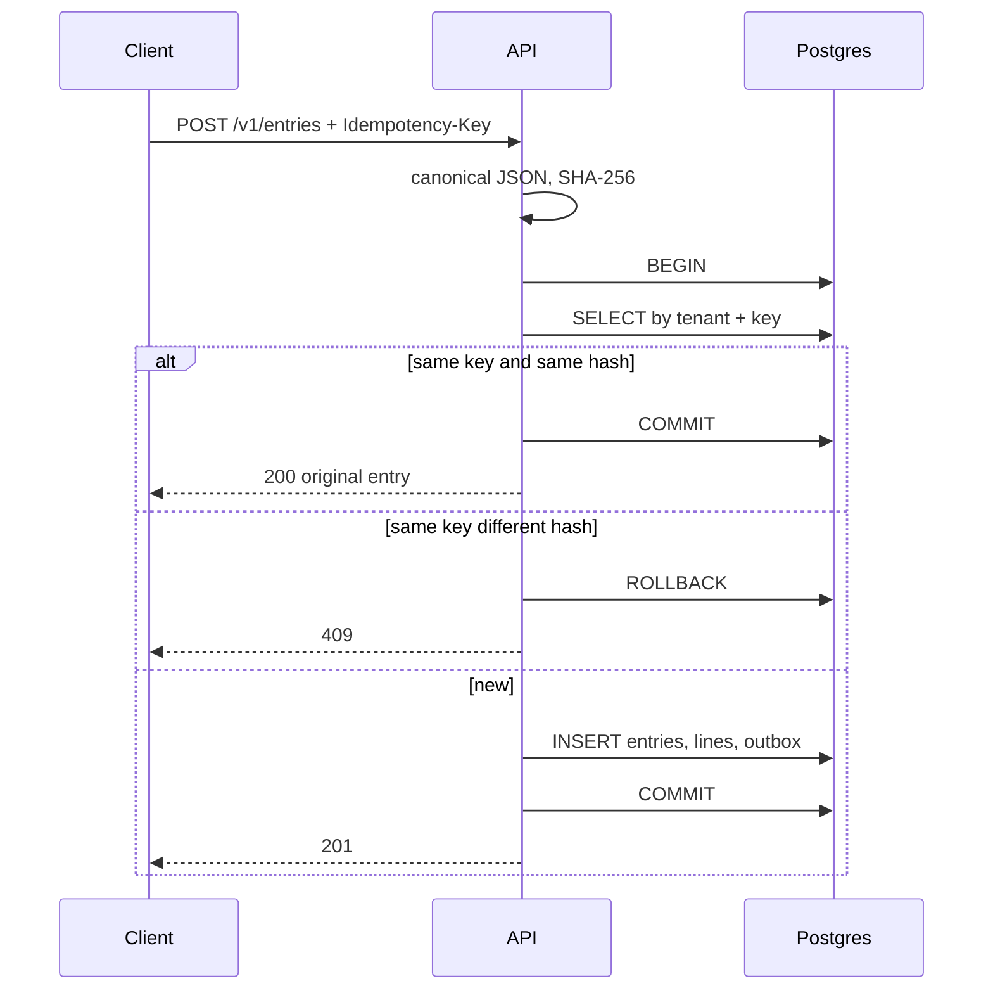
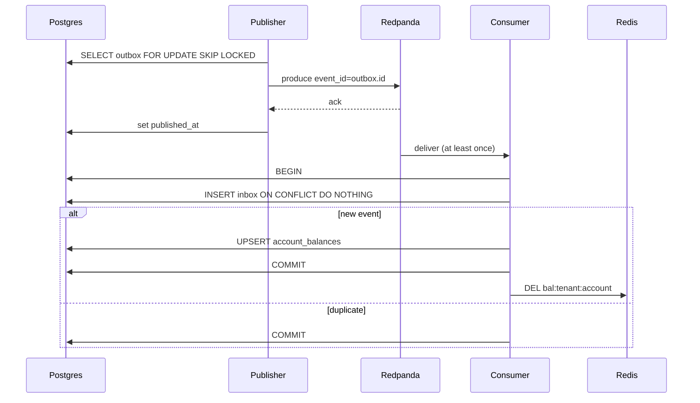

# Architecture

Servitor is a multi-tenant double-entry ledger. Callers post journal entries
(balanced debit/credit lines). Postgres is the source of truth. After commit,
a worker publishes to Redpanda and another worker updates a read-model
balance and invalidates Redis.

## Components

Rules:

- The API never talks to Redpanda on the request path.
- The API never writes Redis when posting an entry.
- Redis is a cache of balances, not the ledger.

## Schema

`amount_cents` is always `bigint`. Never `f64` (floats cannot represent cents exactly).
`created_at` is always Postgres `now()`, never the app clock.
Public ids are UUID v7 (time-sortable; we choose this in Step 4).

### tenants
- id (uuid, PK)
- name (text)
- created_at (timestamptz, default now())

### api_keys
- id (uuid, PK)
- tenant_id (uuid, FK tenants)
- key_hash (bytea)
- prefix (text)
- created_at (timestamptz)
- revoked_at (timestamptz, null = active)

### accounts
- id (uuid, PK)
- tenant_id (uuid, FK tenants)
- name (text)
- currency (char(3), only USD)
- created_at (timestamptz)
- unique (tenant_id, name)

### entries
- id (uuid, PK)
- tenant_id (uuid, FK tenants)
- idempotency_key (text)
- request_hash (char(64), SHA-256 hex)
- reverses_entry_id (uuid, nullable, FK entries)
- created_at (timestamptz)
- unique (tenant_id, idempotency_key)

### entry_lines
- id (uuid, PK)
- entry_id (uuid, FK entries, ON DELETE RESTRICT)
- account_id (uuid, FK accounts)
- amount_cents (bigint, must be > 0)
- side (text, 'debit' or 'credit')

### outbox
- id (uuid, PK)  ← this id is the event_id on the wire
- topic (text)   ← always `ledger.entries`
- payload (jsonb)
- created_at (timestamptz)
- published_at (timestamptz, null until acked)

### inbox
- event_id (uuid, PK)  ← same as outbox.id
- applied_at (timestamptz)

### account_balances
- account_id (uuid, PK, FK accounts)
- tenant_id (uuid)
- posted_cents (bigint)
- updated_at (timestamptz)

## Indexes
- api_keys (prefix)
- accounts (tenant_id, id)
- entries (tenant_id, id)
- entry_lines (account_id, entry_id)
- outbox (created_at) where published_at IS NULL

## Decisions

### IDs
All public ids (tenants, accounts, entries, lines, outbox, api_keys) are UUID v7.
Store as Postgres `uuid`. Expose as lowercase hyphenated strings.

### Idempotency
Header `Idempotency-Key` is required on POST /v1/entries (and gRPC metadata
`idempotency-key`). Missing → 400 `missing_idempotency_key`.

request_hash = SHA-256 of canonical JSON of the body only:

- UTF-8, minified (no extra spaces)
- Object keys sorted alphabetically
- `lines` stay in client order (do not sort lines)
- `amount_cents` is a JSON integer
- `side` is "debit" or "credit"
- `reverses_entry_id` is always in the object: uuid string or null

gRPC hashes this same JSON, not protobuf bytes, so REST and gRPC agree.

On post:
1. Look up (tenant_id, idempotency_key).
2. Found + hash matches → return existing entry.
3. Found + hash differs → 409 `idempotency_key_reuse`.
4. Not found → insert entry + lines + outbox in one transaction.

### Cross-tenant
Wrong tenant or missing id → 404 `not_found` (do not leak that the id exists).

### readyz
GET /healthz = process up.
GET /readyz = Postgres ping AND Redis ping AND Redpanda. Any miss → 503.
GET still falls back to Postgres if Redis times out (200ms). Ready is stricter.

### event_id
Kafka payload `event_id` is `outbox.id`. Never mint a new id per publish
attempt, or inbox cannot detect duplicates.

## Failure modes

| Failure | What we do |
| --- | --- |
| API crash after COMMIT, before HTTP 201 | Client retries same Idempotency-Key; gets the same entry |
| Publisher crash after Kafka ack, before published_at | Re-publish; consumer inbox ignores duplicate event_id |
| Publisher crash before Kafka ack | Re-publish; same as above |
| Redis down | GET uses account_balances; readyz returns 503 |
| Redpanda down | POST still succeeds (outbox grows); readyz 503; lag rises |
| Consumer crash mid-apply | inbox + balance are one transaction; both roll back |
| Clock skew | created_at from DB now() only |

## Sequences

### Post entry





## Post algorithm
1. Bearer key → tenant_id. Bad/revoked key → 401.
2. Require Idempotency-Key.
3. Canonicalize body, SHA-256 → request_hash.
4. BEGIN.
5. SELECT entries by (tenant_id, idempotency_key).
   - hit, hash equal → COMMIT, return 200.
   - hit, hash different → ROLLBACK, 409.
6. Load accounts. Missing/wrong tenant → 404. Not USD / mixed currency → 422.
7. At least two lines; sum(debits) == sum(credits); amounts > 0. Else 422.
8. If reverses_entry_id set, that entry must exist in this tenant. Else 404.
   Client sends the reversing lines; we only store the pointer.
9. INSERT entries, entry_lines, outbox (payload below).
10. COMMIT.
11. Return 201. Do not publish. Do not write Redis. Do not touch account_balances.

## Outbox payload
```json
{
  "event_id": "<outbox.id>",
  "event_type": "entry.posted",
  "tenant_id": "...",
  "entry_id": "...",
  "created_at": "<rfc3339 from DB>",
  "lines": [
    {"account_id": "...", "amount_cents": 100, "side": "debit"},
    {"account_id": "...", "amount_cents": 100, "side": "credit"}
  ]
}
```

Errors
JSON { "code", "message", "request_id" } on all /v1 failures.

code	HTTP
unauthenticated
401
not_found
404
missing_idempotency_key
400
validation_error
400
unbalanced_entry
422
invalid_entry
422
idempotency_key_reuse
409
not_ready
503
internal
500
